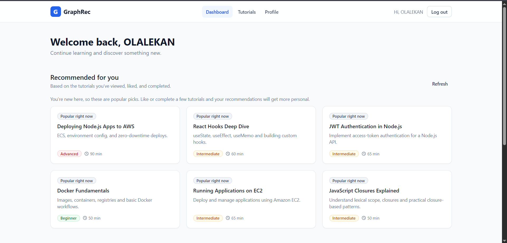
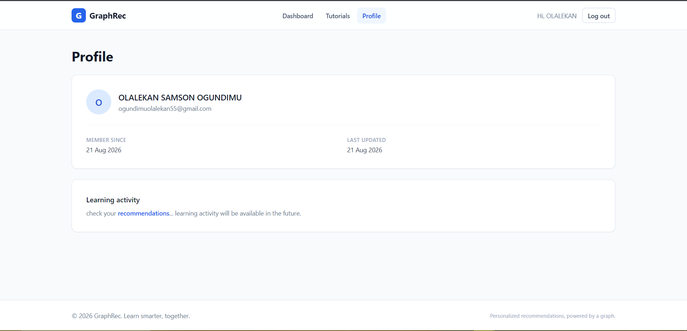

# GraphRec

**A graph-powered tutorial recommendation platform, built on CognoDB.**

- 🌐 Live app: **https://graphrec-fe.vercel.app/**
- 🔌 Live API: **https://graphrec-ja03.onrender.com/**
- 🩺 API health check: https://graphrec-ja03.onrender.com/health
- backend repo: **https://github.com/sam-the-champ/graphrec**

> Note: the backend is hosted on Render's free tier, which spins down
> after inactivity — the first request after a period of idle time can
> take 20–30 seconds to respond while the instance wakes up. Subsequent
> requests are fast.

---

## 1. The use case

GraphRec is an educational platform (tutorials, courses, topics, skills,
instructors) where a user's behavior — viewing, liking, and completing
tutorials — builds up a graph of relationships, and a recommendation
engine traverses that graph to suggest what to learn next.

The core idea: two tutorials don't have to share a tag for one to be a
good follow-up to the other. "React Hooks Deep Dive" is a natural next
step after "JavaScript Fundamentals" not because they're both labeled
`javascript`, but because **JavaScript relates to React**, and someone
who just finished a JavaScript tutorial is plausibly ready for it. That
relationship — topic-to-topic, skill-to-skill — is exactly the kind of
structure a graph models directly and a relational schema has to fake.

---

## 2. Why a graph database?

**The interesting part of this problem is the connections, not the
rows.** Concretely, answering "what should this user learn next?" means
walking a path like:

```
User -[:LIKED]-> Tutorial -[:ABOUT]-> Topic -[:RELATED_TO]-> Topic <-[:ABOUT]- Candidate Tutorial
```

In CognoDB/Cypher, that's one readable pattern-match, and the engine
walks it via direct pointer-following (index-free adjacency) — the cost
of each additional hop stays roughly constant.

In PostgreSQL, the same traversal is a **self-join on `topic_relations`
combined with two more joins into `tutorials`**, and the moment you want
to go two hops out (related-to-a-related-topic) instead of one, you're
either writing a recursive CTE or hardcoding the hop count. It works,
but it stops being a query you'd want to explain to a teammate, and it
gets slower and uglier with every additional hop — while the Cypher
version doesn't change shape at all if you decide to traverse three hops
instead of two.

There's a second reason a graph model earns its place here: **the
relationships themselves carry data that matters to the product.**
`VIEWED` has a `viewCount` and timestamps; `COMPLETED` has a `progress`.
In a relational schema those would live in join tables that exist purely
as plumbing. Here, they're first-class — a relationship *is* the
interesting fact, not an artifact of normalization.

Finally, the recommendation query in this app (see §6) traverses **five
different relationship paths in one round trip and lets the graph engine
score and rank the results** — that's the kind of set-based,
relationship-heavy aggregation a graph engine is built for, and a
relational engine has to work considerably harder to express.

---

## 3. Data model

```
                        ┌────────────┐
                        │  Instructor │
                        └─────┬──────┘
                     TAUGHT_BY│
                              ▼
┌────────┐   VIEWED    ┌───────────┐   ABOUT    ┌───────┐  RELATED_TO
│  User  │────────────▶│ Tutorial  │───────────▶│ Topic │◀───────────┐
│        │   LIKED     │           │            └───────┘            │
│        │────────────▶│           │   TEACHES  ┌───────┐  RELATED_TO│
│        │  COMPLETED  │           │───────────▶│ Skill │◀───────────┘
└────────┘────────────▶└─────┬─────┘            └───────┘
                              ▲
                       CONTAINS│
                        ┌──────┴──────┐
                        │   Course    │
                        └─────────────┘
```

**Nodes**

| Label | Key properties |
|---|---|
| `User` | `id`, `name`, `email` (unique), `passwordHash` |
| `Tutorial` | `id`, `title`, `description`, `contentUrl`, `difficulty`, `duration` |
| `Course` | `id`, `title`, `description` |
| `Topic` | `id`, `name`, `slug` (unique) |
| `Skill` | `id`, `name`, `slug` (unique) |
| `Instructor` | `id`, `name`, `bio` |

**Relationships**

| Relationship | Carries |
|---|---|
| `(User)-[:VIEWED]->(Tutorial)` | `viewCount`, `firstViewedAt`, `lastViewedAt` |
| `(User)-[:LIKED]->(Tutorial)` | `createdAt` |
| `(User)-[:COMPLETED]->(Tutorial)` | `completedAt`, `progress` |
| `(Tutorial)-[:ABOUT]->(Topic)` | — |
| `(Tutorial)-[:TEACHES]->(Skill)` | — |
| `(Tutorial)-[:TAUGHT_BY]->(Instructor)` | — |
| `(Course)-[:CONTAINS]->(Tutorial)` | — |
| `(Topic)-[:RELATED_TO]->(Topic)` | — |
| `(Skill)-[:RELATED_TO]->(Skill)` | — |

Uniqueness constraints on `User.email`, `Tutorial.id`, `Topic.slug`,
`Skill.slug`, etc. are declared in
[`backend/src/database/migrations/001-initial-schema.js`](backend/src/database/migrations/001-initial-schema.js),
using `CREATE CONSTRAINT ... IF NOT EXISTS` so the script is safe to run
repeatedly.

---

## 4. Screenshots

## 4. Screenshots






---

## 5. Setup & run instructions

### 5.1 Create your CognoDB Cloud instance

1. Sign up at https://console.cognodb.com/signup (free tier, no card
   required).
2. Create a free **c0** instance and pick a region — provisions in
   under a minute.
3. Copy the connection URI (`bolt+s://<instance-id>.databases.cognodb.cloud`)
   and the generated password for the `cognodb` user. **The password is
   shown once** — save it immediately wherever your app reads secrets
   from (see below).

### 5.2 Backend

```bash
cd backend
npm install
cp .env.example .env
```

Fill in `.env`:

```
PORT=5000
NODE_ENV=development

COGNODB_URI=bolt+s://<instance-id>.databases.cognodb.cloud
COGNODB_USERNAME=cognodb
COGNODB_PASSWORD=<the password CognoDB showed you once>

JWT_ACCESS_SECRET=<a long random string>
JWT_ACCESS_EXPIRES_IN=1h
CORS_ORIGIN=http://localhost:5173
```

Then:

```bash
npm run db:migrate   # creates constraints/indexes — safe to re-run
npm run db:seed       # loads realistic seed data (users, tutorials, topics, skills, relationships)
npm run dev            # starts the API on :5000
```

Confirm it's connected:

```bash
curl http://localhost:5000/health/db
```

### 5.3 Frontend

```bash
cd frontend
npm install
cp .env.example .env
```

Fill in `.env`:

```
VITE_API_BASE_URL=http://localhost:5000/api
```

```bash
npm run dev   # http://localhost:5173
```

### 5.4 Connecting to the official Neo4j driver

No custom SDK is involved — the backend uses the standard
[`neo4j-driver`](https://www.npmjs.com/package/neo4j-driver) npm package
and speaks openCypher over Bolt, per CognoDB's own setup instructions:

```js
// backend/src/database/driver.js
neo4j.driver(
  env.cognodb.uri,                                    // bolt+s://...
  neo4j.auth.basic(env.cognodb.username, env.cognodb.password)
);
```

---

## 6. The main queries, explained

All queries are parameterized through the driver (`$paramName` — never
string concatenation) and live in `backend/src/repositories/`.

### The recommendation traversal (multi-hop + the "SQL would find this awkward" query)

`backend/src/repositories/recommendation.repository.js` — this is the
heart of the app. For a given user, it walks **five separate relationship
paths in one query**, two of which are two hops deep, sums a weighted
score per candidate tutorial, and ranks the results — all inside CognoDB:

```cypher
MATCH (u:User {id: $userId})
OPTIONAL MATCH (u)-[:VIEWED|LIKED|COMPLETED]->(consumed:Tutorial)
WITH u, collect(DISTINCT consumed.id) AS consumedIds

CALL {
  WITH u, consumedIds
  MATCH (u)-[:LIKED]->(:Tutorial)-[:ABOUT]->(topic:Topic)<-[:ABOUT]-(candidate:Tutorial)
  WHERE NOT candidate.id IN consumedIds
  RETURN candidate, 5 AS score, 'liked_topic_match' AS reason

  UNION ALL
  WITH u, consumedIds
  MATCH (u)-[:LIKED]->(:Tutorial)-[:ABOUT]->(:Topic)-[:RELATED_TO]->(:Topic)<-[:ABOUT]-(candidate:Tutorial)
  WHERE NOT candidate.id IN consumedIds
  RETURN candidate, 3 AS score, 'related_topic' AS reason
  -- ...three more branches for completed/skill and viewed paths
}

WITH candidate, sum(score) AS traversalScore, collect(DISTINCT reason) AS reasons
OPTIONAL MATCH (:User)-[engagement:VIEWED|LIKED|COMPLETED]->(candidate)
WITH candidate, traversalScore, reasons, count(engagement) AS engagementCount
RETURN candidate, traversalScore + (toFloat(engagementCount) * 0.1) AS score, reasons, engagementCount
ORDER BY score DESC
LIMIT $limit
```

**Why this is the awkward-in-SQL query:** the second `UNION ALL` branch
above is a **two-hop traversal** (liked tutorial → its topic → a
*related* topic → a different tutorial about that related topic). In
PostgreSQL this needs a self-join against a `topic_relations` table
sandwiched between two joins into `tutorial_topics` and `tutorials` —
and if the product later asks for three hops instead of two ("related
to a related topic"), the SQL has to be rewritten with another join or
turned into a recursive CTE. The Cypher version above just gets one more
`-[:RELATED_TO]->` hop appended to the pattern; the shape of the query
doesn't change.

If the traversal returns nothing (a brand-new user with no interaction
history), a second query falls back to popularity/recency — see
`FALLBACK_QUERY` in the same file, so the UI never shows an empty
dashboard.

### Idempotent interaction writes

`backend/src/repositories/interaction.repository.js` — clicking "Like"
twice shouldn't create two `LIKED` relationships. Every interaction uses
`MERGE`, which finds-or-creates:

```cypher
MATCH (u:User {id: $userId}), (t:Tutorial {id: $tutorialId})
MERGE (u)-[r:VIEWED]->(t)
ON CREATE SET r.viewCount = 1, r.firstViewedAt = $now, r.lastViewedAt = $now
ON MATCH SET r.viewCount = r.viewCount + 1, r.lastViewedAt = $now
```

### Idempotent schema setup

`backend/src/database/migrations/001-initial-schema.js` — every
constraint uses `IF NOT EXISTS`, so `npm run db:migrate` can be re-run
on every deploy without erroring on "already exists."

---

## 7. Architecture

```
Frontend (React + TypeScript + Vite, hosted on Vercel)
  ↓ REST (Axios, Bearer JWT)
Backend (Express, hosted on Render)
  ↓
Routes → Auth middleware → Controllers → Repositories
  ↓
neo4j-driver (official) → Bolt → CognoDB Cloud
```

- **Config & secrets**: `backend/src/config/env.js` validates required
  environment variables at startup and fails fast with a clear error if
  any are missing — connection details are never hardcoded or committed.
- **Connection lifecycle**: one driver instance for the app's lifetime
  (`backend/src/database/driver.js`), short-lived sessions per request
  (`session.js`), closed via `finally` and on `SIGINT`/`SIGTERM`.
- **Error handling when the database is unreachable**: a centralized
  error middleware (`backend/src/middleware/error.middleware.js`)
  classifies Neo4j driver errors (e.g. `ServiceUnavailable`) into a
  `503` with a safe message — never a raw stack trace to the client —
  and `GET /health/db` actively verifies connectivity rather than just
  returning `{status: "ok"}` unconditionally.
- **Layering**: Route → Middleware → Controller → Repository, with no
  service layer beyond the recommendation repository (which owns the
  traversal/scoring/fallback logic and doesn't need a separate service
  wrapping it — see comments in that file).

---

## 8. Repository structure

```
.
├── backend/
│   ├── src/
│   │   ├── config/          # env validation
│   │   ├── database/        # driver, sessions, migrations, seed
│   │   ├── middleware/       # auth, validation, error handling
│   │   ├── repositories/     # all Cypher lives here, parameterized
│   │   ├── controllers/
│   │   ├── routes/
│   │   ├── validators/       # Zod schemas
│   │   └── app.js / server.js
│   ├── .env.example
│   └── package.json
├── frontend/
│   ├── src/
│   │   ├── api/               # Axios client + one module per resource
│   │   ├── components/
│   │   ├── pages/
│   │   ├── hooks/ context/ routes/ types/
│   │   └── App.tsx / main.tsx
│   ├── .env.example
│   └── package.json
└── README.md
```

---

## 9. Requirements checklist

| Requirement | Where |
|---|---|
| Labeled nodes, typed relationships, properties, diagram | §3 |
| Seed script in repo | `backend/src/database/seed.js`, run via `npm run db:seed` |
| Multi-hop traversal (2+ hops) | `RECOMMENDATION_QUERY`, related-topic/related-skill branches — §6 |
| A query relational DBs find awkward | Same query — explained in §6 |
| Parameterized queries, official driver | Every repository file uses `tx.run(cypher, { params })`; `neo4j-driver` npm package |
| Functional web app, non-technical usable | https://graphrec-fe.vercel.app/ |
| Loading / empty / error states | `SkeletonGrid`, `EmptyState`, `ErrorState` components used across all data-driven pages |
| Secrets via env vars, not committed | `.env.example` only; `.env` is git-ignored in both projects |
| Graceful DB-unreachable handling | §7, `error.middleware.js`, `/health/db` |
| Hosted demo link | Frontend + backend links at top of this file |